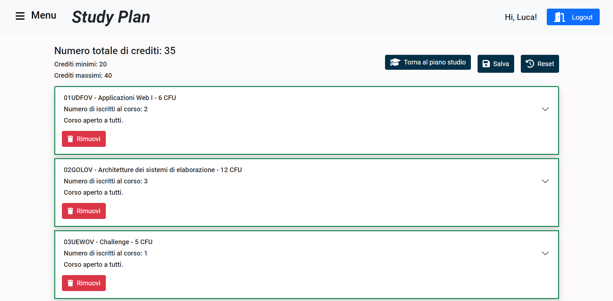

# Exam #1: "Piano degli studi"
## Student: s303907 TAMBURO LUCA 

## React Client Application Routes

## Available Routes

All routes available are listed below.

- **`/`** : Index route where if you are not logged in you will find the log in button and the complete list of courses offered by the university sorted alphabetically by course name, while if you are logged in on you will find the log out button, the same courses described earlier, and an offcanvas menu that allows me to navigate through the courses and the syllabus.

- **`/login`** : In this route you can find the login form.

- **`/study-plan`** : **This route is protected. The user must be authenticated to navigate here.** If a study plan has not been created you can create it by choosing from two options: part-time and full-time. If the study plan exists or has just been created the courses present (if available) will be displayed and you can edit and/or delete the study plan.

- **`/study-plan/edit`** : **This route is protected. The user must be authenticated to navigate here.** You can add and/or remove one or more courses from the study plan.

- **`/*`** Any other route is matched by this one where the application shows a page not found error.

## API Server

Hereafter, we report the designed HTTP APIs, also implemented in the project.

#### `POST /api/sessions`

Performs user authentication and create a new session for the user.

##### **Request header:**

`Content-Type: application/json`

##### **Request body:**

A JSON object containing username and password.

```
{
    "username": "user1@polito.it",
    "password": "password"
}
```

##### **Response body**

`HTTP status code 200 OK`

```
{
    "id": 1,
    "email": "user1@polito.it",
    "name": "Luca"
}
```

##### **Error responses**

- `HTTP status code 500 Internal Server Error` (generic server error)
- `HTTP status code 422 Unprocessable Entity` (validation error)
- `HTTP status code 401 Unauthorized` (credentials error)

#### `DELETE /api/sessions/current`

Performs user logout and delete the current user session.

##### **Request header:**

`Session: req.user to retrieve the logged in user id`

##### **Response body**

`HTTP status code 200 OK`

##### **Error responses**

- `HTTP status code 500 Internal Server Error` (generic server error)

#### `GET /api/sessions/current`

Gets information about the user, if he is logged in.

##### **Request header:**

`Session: req.user to retrieve the logged in user id`

##### **Response body**

`HTTP status code 200 OK`

```
{
    "id": 1,
    "email": "user1@polito.it",
    "name": "Luca"
}
```

##### **Error responses**

- `HTTP status code 500 Internal Server Error` (generic server error)
- `HTTP status code 404 Not Found` (user not found error)
- `HTTP status code 401 Unauthorized` (authentication error)


#### `GET /api/courses/all`

Gets all course information.

##### **Request header:**

`Content-Type: application/json`

##### **Response body**

`HTTP status code 200 OK`

```
[
    {
        "code": "01UDFOV",
        "name": "Applicazioni Web I",
        "CFU": 6,
        "max_students": null,
        "propaedeuticity": {
            "code": null,
            "name": null
        },
        "registered_students": 0,
        "incompatibilities": [
            {
                "code": "01TXYOV",
                "name": "Web Applications I"
            }
        ]
    },
    {
        "code": "01URSPD",
        "name": "Internet Video Streaming",
        "CFU": 6,
        "max_students": 2,
        "propaedeuticity": {
            "code": null,
            "name": null
        },
        "registered_students": 0
    },

    ...
```

##### **Error responses**

- `HTTP status code 500 Internal Server Error` (generic server error)
- `HTTP status code 404 Not Found` (course or incompatibility not found error )

#### `GET /api/study-plans`

Gets all the information about the study plan associated with the connected user.

##### **Request header:**

`Session: req.user to retrieve the logged in user id`

##### **Response body**

`HTTP status code 200 OK`

```
{
    "id": 13,
    "id_course_list": 1,
    "plan_type": {
        "name": "PART-TIME",
        "min_credits": 20,
        "max_credits": 40
    },
    "tot_credits": 23,
    "courses": [
        "01UDFOV",
        "02GOLOV",
        "03UEWOV"
    ]
}
```

##### **Error responses**

- `HTTP status code 500 Internal Server Error` (generic server error)
- `HTTP status code 404 Not Found` (user study plan not found error)
- `HTTP status code 401 Unauthorized` (authentication error)

#### `GET /api/study-plans/types`

Gets all the information about the two study plans, if user is logged in.

##### **Request header:**

`Session: req.user to retrieve the logged in user id`

##### **Response body**

`HTTP status code 200 OK`

```
[
    {
        "id": 1,
        "name": "PART-TIME",
        "min_credits": 20,
        "max_credits": 40
    },
    {
        "id": 2,
        "name": "FULL-TIME",
        "min_credits": 60,
        "max_credits": 80
    }
]
```

##### **Error responses**

- `HTTP status code 500 Internal Server Error` (generic server error)
- `HTTP status code 404 Not Found` (study plan types not found error)
- `HTTP status code 401 Unauthorized` (authentication error)

#### `POST /api/study-plans`

Creates a new study plan associated with the logged in user.

##### **Request header:**

`Session: req.user to retrieve the logged in user id`
`Content-Type: application/json`

##### **Request body:**

A JSON object containing the list of courses, type of study plan, and total credits.

```
{
    "courses":["02GOLOV", "01UDFOV"],
    "type_id": "1",
    "tot_credits": "20"
}
```

##### **Response body**

```
HTTP status code 200 OK`
```

##### **Error responses**

- `HTTP status code 500 Internal Server Error` (generic server error)
- `HTTP status code 422 Unprocessable Entity` (validation error)
- `HTTP status code 401 Unauthorized` (credentials error)

#### `PUT /study-plans/:id`

Edits a study plan associated with the logged-in user, given the study plan id.

##### **Request header:**

`Session: req.user to retrieve the logged in user id`
`Params: req.params.id to retrieve study plan id`

##### **Request body:**

A JSON object containing an array with courses removed, an array with courses added, and the new credit total.

```
{
    "old_course": ["02GOLOV", "01UDFOV"], 
    "new_course":["01SQJOV", "02GRSOV", "03UEWOV", "01TYMOV"],
    "tot_credits": "30"
}
```

##### Response body

`HTTP status code 200 OK`


##### Error responses

- `HTTP status code 500 Internal Server Error` (generic server error)
- `HTTP status code 422 Unprocessable Entity` (validation error)
- `HTTP status code 404 Not Found` (study plan not found error)
- `HTTP status code 401 Unauthorized` (authentication error)


#### `DELETE /api/study-plans/:id`

Delete a study plan associated with the logged in user, given the study plan id.

##### **Request header:**

`Session: req.user to retrieve the logged in user id`
`Params: req.params.id to retrieve study plan id`

##### Response body

`HTTP status code 200 OK`

##### Error responses

- `HTTP status code 500 Internal Server Error` (generic server error)
- `HTTP status code 404 Not Found` (study plan not found error)
- `HTTP status code 401 Unauthorized` (authentication error)

## Database Tables

### The tables used in this project are:
#### _course_ includes all course specifications.
```
course (code, name, CFU, max_students, propaedeuticity, registered_students)
    PRIMARY KEY ( code )
    UNIQUE ( code )
    FOREIGN KEY( propaedeuticity ) REFERENCES course ( code )
    DEFAULT 0 ( registeredstudents )
```
#### _course list_ includes all course list information associated with a study plan 
```
course_list (id, course_code)
    PRIMARY KEY ( id, coursecode )
    FOREIGN KEY ( coursecode ) REFERENCES course ( code )
```
#### _incompatibility_ includes all information on incompatibilities with other courses.
```
incompatibility (id, course_code, inc_code)
    PRIMARY KEY ( id  AUTOINCREMENT )
    UNIQUE ( id )
    FOREIGN KEY ( coursecode ) REFERENCES course ( code )
    FOREIGN KEY ( inc_code ) REFERENCES course ( code )
```
#### _study plan_ includes all study plan specifications.
```
study_plan (id, user_id, course_list_id, type, tot_credits)
    PRIMARY KEY ( id  AUTOINCREMENT )
    UNIQUE ( id, user_id, course_list_id)
    FOREIGN KEY ( userid ) REFERENCES user ( id )
    FOREIGN KEY ( course_list_id ) REFERENCES course_list( id )
    FOREIGN KEY ( type ) REFERENCES study_plan_option ( id )
    DEFAULT 0 ( tot_credits )
```
#### _study plan option_ includes all study plan type specifications.
```
study_plan_option (id, name, min_credits, max_credits)
	PRIMARY KEY  ( id AUTOINCREMENT )
    UNIQUE  ( _d )
```
#### _user_ includes all user specifications.
```
user (id, name, email, password, salt)
    PRIMARY KEY ( id  AUTOINCREMENT )
    UNIQUE ( id, email  )
```
## Source Directory Structure

Here you can find a visual schema of source directory structure by means the tree chart below and a short description for each folder.

```
|--- /client
     |--- /public
     |    |--- /favicon.ico
     |    |--- /index.html
     |    |--- /logo192.png
     |    |--- /logo512.png
     |    |--- /manifest.json
     |    |--- /robots.txt
     |    |
     |--- /src
     |    |--- /components (It containes all components used)
     |    |    |--- /AppContainer.jsx
     |    |    |--- /Course.jsx
     |    |    |--- /Footer.jsx
     |    |    |--- /Input.jsx
     |    |    |--- /LoginForm.jsx
     |    |    |--- /Navbar.jsx
     |    |    |--- /ProtectedRoute.jsx
     |    |    |--- /Sidebar.jsx
     |    |    |
     |    |--- /contexts
     |    |    |--- /AuthContext.js
     |    |    |
     |    |--- /hooks (It contains all custom hooks used)
     |    |    |--- /useNotification.js
     |    |    |
     |    |--- /services (It contains all APIs)
     |    |    |--- /api.js
     |    |    |
     |    |--- /view (It contains all pages of the application)
     |    |    |--- /EditStudyPlan.jsx
     |    |    |--- /ErrorView.jsx
     |    |    |--- /Home.jsx
     |    |    |--- /index.jsx
     |    |    |--- /Login.jsx
     |    |    |--- /StudyPlan.jsx
     |    |    |
     |    |--- /App.css
     |    |--- /App.jsx
     |    |--- /App.test.js
     |    |--- /index.css
     |    |--- /index.js
     |    |--- /reportWebVitals.js
     |    |--- /setupTests.js
     |--- /.gitignore
     |--- /package-lock.json
     |--- /package.json
     |--- /README.md
     |
|--- /server
     |--- /db
     |    |--- /dbmiddleware.js
     |    |
     |--- /middlewares
     |    |--- /withAuth.js
     |----|--- /withConstraints.js
     |    |
     |--- /models
     |    |--- /courseListModel.js
     |    |--- /courseModel.js
     |    |--- /studyPlanModel.js
     |    |--- /usersModel.js
     |    |
     |--- /public
     |    |--- /img
     |    |    |--- /404_page_not_found.svg
     |    |    |--- /add_study_plan.svg
     |    |  
     |--- /routes
     |    |--- /courseRouter.js
     |    |--- /sessions.js
     |    |--- /studyPlanRouter.js
     |    |
     |--- /.index.js
     |--- /package-lock.json
     |--- /package.json
     |--- /study_plan.db
     |
|--- /gitignore
|--- /README.md


```
## Main React Components

- `Course` (in `Course.jsx`): Component that displays all course information and there are two buttons to add and/or remove a course from study plan.
- `EditStudyPlan` (in `EditStudyPlan.jsx`): Component that allows me to add and/or remove courses from a curriculum and save it if it meets the constraints.
- `LoginForm` (in `LoginForm.js`): Component that manages a user's login.
- `StudyPlan` (in `LoginForm.js`): Component that allows a study plan to be created if one does not exist associated with a user, otherwise if one exists it allows it to be deleted or modified.

## Screenshot



## Users Credentials

Here you can find a list of the users already registered inside the provided database. 

| email           | password | name     |study plan type|
|:---------------:|:--------:|:--------:|:-------------:|
| user1@polito.it | password | Luca     |PART-TIME      |
| user2@polito.it | password | Enrico   |FULL-TIME      |
| user3@polito.it | password | Filippo  |PART-TIME      |
| user4@polito.it | password | Luigi    |PART-TIME      |
| user5@polito.it | password | Antonio  |               |

